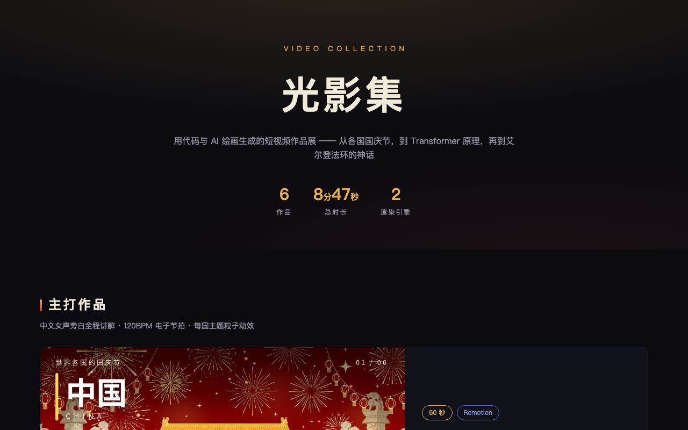

# Video Gallery / 光影集视频作品展

中文：用代码与 AI 绘画制作的短视频作品展。汇集 Remotion 与 Motion Canvas 两套代码渲染引擎制作的 6 部短视频（涵盖各国国庆节文化巡礼、Transformer 注意力机制可视化与游戏神话编年史），支持灯箱播放与全屏欣赏。

English: Video exhibition website featuring short films rendered programmatically with Remotion and Motion Canvas, combined with generative AI visuals. Includes 6 curated videos spanning cultural histories, machine learning visualizations, and game mythologies with interactive playback.



## 在线体验 / Live Demo

- [Cloudflare Demo](https://video-gallery.xiaosang.cc/)
- [GitHub Repo](https://github.com/holynova/video-gallery)


## 本地运行 / Run locally

```bash
open index.html
```

## 发布 / Deploy

```bash
npx wrangler deploy --config wrangler.jsonc
```

Cloudflare Workers · Custom Domain: `video-gallery.xiaosang.cc`

源码与部署配置使用同一个主分支；在本地手动发布，不创建 Cloudflare 专用分支或 GitHub Action。
